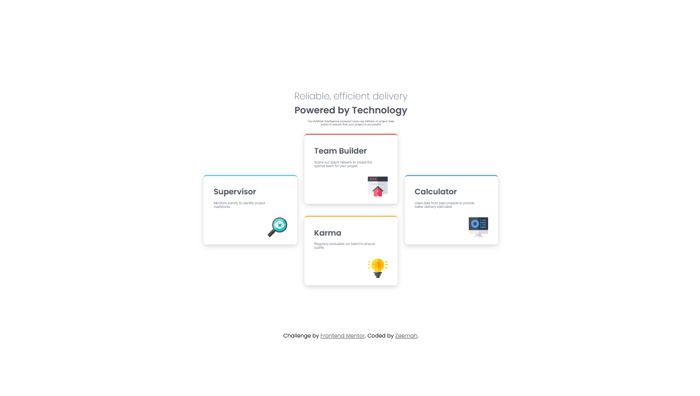

# Frontend Mentor - Four card feature section solution

This is a solution to the [Four card feature section challenge on Frontend Mentor](https://www.frontendmentor.io/challenges/four-card-feature-section-weK1eFYK).

### Screenshot

### Links

- Solution URL: [https://github.com/Z3emah/four-card-feature-section-master](https://github.com/Z3emah/four-card-feature-section-master)
- Live Site URL: [ https://z3emah.github.io/four-card-feature-section-master/]( https://z3emah.github.io/four-card-feature-section-master/)

### Built with

- Semantic HTML5 markup
- CSS custom properties
- CSS Grid

## Author

- Frontend Mentor - [@Z3emah](https://www.frontendmentor.io/profile/Z3emah)
